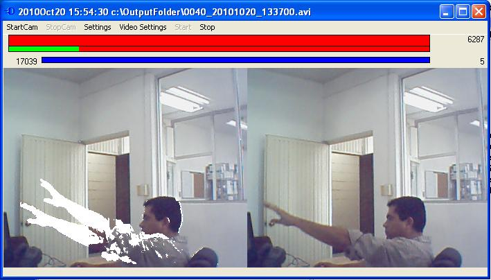



## Video Surveilance program\. Creates/stores AVI files on motion detection\. No activex or OCX controls\.

### Description

captures video from any windows camera. detects motion. sensitivity can be adapted to camera and environment quality. creates AVI video files and appends frames when motion threshold is reached. video format can be using in theory any windows codec (by I recommend use fddshow which can be installed from the CCCP codec pack (available at internet). this codec has proven to be the more stable one, and also is compressed. this program do not uses any external ocx or dll.
 
### More Info
 

             |
---                |---
**Submitted On**   |2010-09-14 12:12:54
**By**             |[Ivan Enriquez](https://github.com/Planet-Source-Code/PSCIndex/blob/master/ByAuthor/ivan-enriquez.md)
**Level**          |Intermediate
**User Rating**    |5.0 (45 globes from 9 users)
**Compatibility**  |VB 6\.0
**Category**       |[Graphics](https://github.com/Planet-Source-Code/PSCIndex/blob/master/ByCategory/graphics__1-46.md)
**World**          |[Visual Basic](https://github.com/Planet-Source-Code/PSCIndex/blob/master/ByWorld/visual-basic.md)
**Archive File**   |[Video\_Surv21911810202010\.zip](https://github.com/Planet-Source-Code/ivan-enriquez-video-surveilance-program-creates-stores-avi-files-on-motion-detection-no-ac__1-73541/archive/master.zip)

